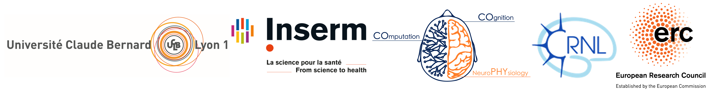
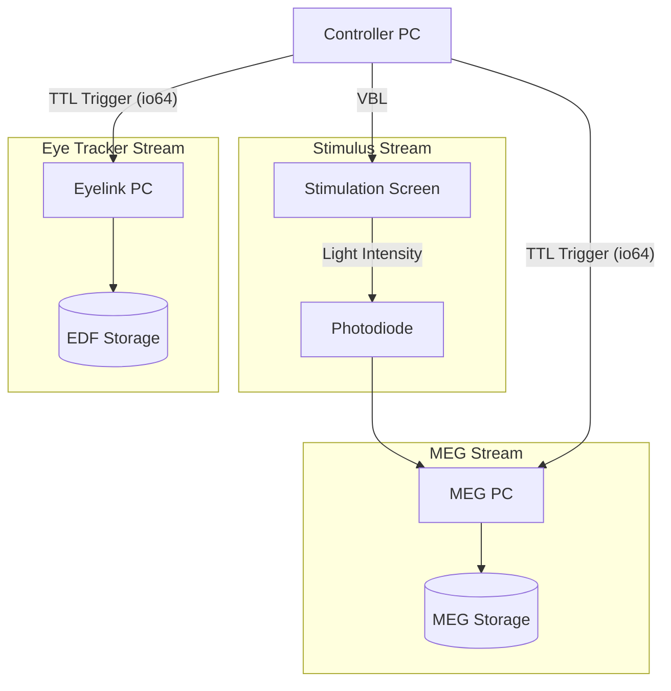
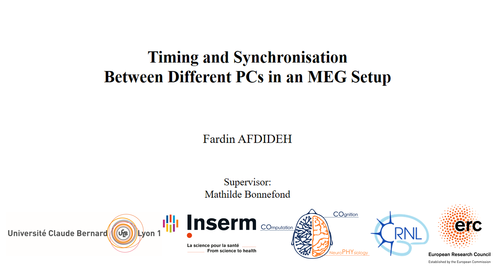

# ⏱️ Synchronization in Multi-PC MEG Setups

This research work was supported by ERC project [BrainDyn](https://cordis.europa.eu/project/id/716862) (PI: Dr. [Mathilde Bonnefond](https://scholar.google.com/citations?user=Xc1fz38AAAAJ&hl=en)).

## 📖 Overview
In complex Magnetoencephalography (MEG) experiments, precise temporal alignment is critical. 
This work characterizes and optimizes the timing synchrony between multiple subsystems: the Controller PC, MEG Acquisition PC, and Eye-Tracking (Eyelink) PC.
The project addresses a fundamental research question: How precise is signal synchronization between different PCs, and can this precision be improved?

## ⚙️ Pipeline
The following workflow illustrates the hardware communication and the trigger markers analyzed to measure latency and drift.

## 🔬 Synchronization in Multi-PC MEG Setups

## 📚 How to cite
* F. Afdideh et al., "Timing and Synchronisation Between Different PCs in an MEG Setup", unpublished.
